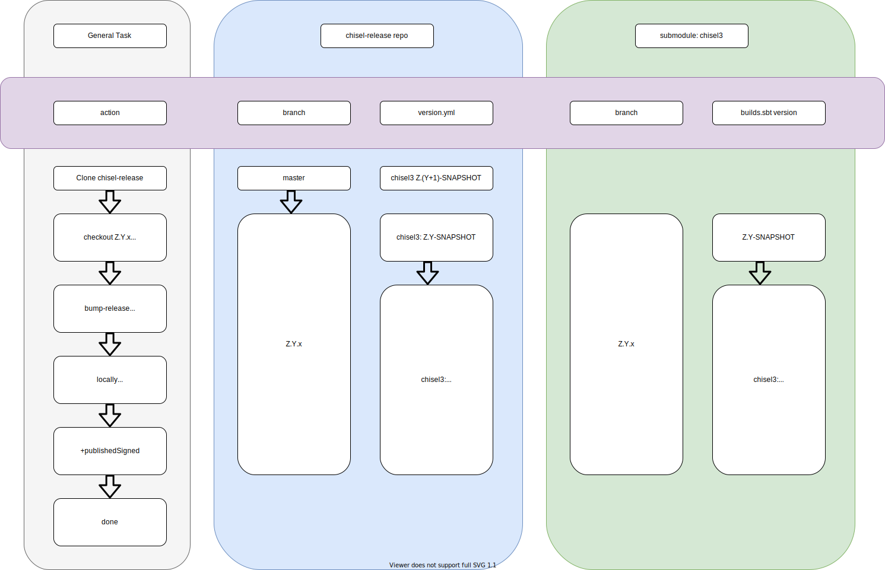

# Publishing Dated Snapshots

The diagram below shows the basic time sequence of the `publish_snapshots.py` script when used to publish dated
snapshots.



## Assumptions about the Chisel repositories

- The `master` branch of each repo has version Z.(Y+1)-SNAPSHOT, i.e. it is one major number ahead of current release
- Repos are kept up to date on there Z.Y.x branch via backporting specified changes from master.
- Repo `chisel-release` has been cloned locally and is accesible to `chisel-repo-tools`
    - It's convenient to use `export REPO=<path-to-repo>`, Following examples will assume this
- [Python Virtual Enviroment Setup](python_venv_setup.md) step have been followed
- [Publshing Setup](publishing_setup.md) steps have been followed

## Run `publish_snapshots.py`

- In the top directory of a clone of chisel-repo-tools with the above assumptions satisfied run this script.
- It is helpful to first run it with the `--list-only` options
-

### A Bit More Setup

- Make sure script is present, let's run it with the help option

```
chisel-repo-tools chick$ python publish/publish_snapshots.py --help
usage: publish_snapshots.py [-h] -r RELEASE_DIR -m MAJOR_VERSION [-d]
                            [-o DATE_STAMP] [-b START_STEP] [-e STOP_STEP]
                            [-l]

optional arguments:
  -h, --help            show this help message and exit
  -r RELEASE_DIR, --release RELEASE_DIR
                        a directory which is a clone of chisel-release
  -m MAJOR_VERSION, --major-version MAJOR_VERSION
                        major number of snapshots being published
  -d, --dated-snapshot  add datestamp to snapshots
  -o DATE_STAMP, --override-date DATE_STAMP
                        overrides the date used for dated snapshots, format
                        YYYYMMDD
  -b START_STEP, --start-step START_STEP
                        command step to start on
  -e STOP_STEP, --stop-step STOP_STEP
                        command step to end on
  -l, --list-only       list command step, do not execute


```

- No args will show standard help info
- List the steps to reinforce what;s going on here
    - Note use of $REPO to point to our chisel-release directory
    - `--list-only` just shows the steps

> Note: `--major-version` is required even with `--list-only`

```
python publish/publish_snapshots.py --release $REPO --major-version 3.4 --dated-snapshot --list-only
These are the steps to be executed for the publish_snapshots script
step   1 checkout_branch
step   2 git_pull
step   3 run_submodule_update_recursive
step   4 run_make_pull
step   5 bump_release
step   6 verify_merge
step   7 run_make_clean_install
step   8 run_make_test
step   9 publish_signed
```

### Run it for real

```build
python publish/publish_snapshots.py --release $REPO --major-version 3.4 --dated-snapshot
```

### What can go wrong

- The test phase can often go wrong as .x version of the repos can fall out of sync
    - This can be debugged locally in the submodules
    - Once fix is determined, it must be `PR`'d to `master` then backported to the `.x` branch
    - This can take some time
- The verify_merge can fail
    - This is usually a problem with rocket-chip, chisel-tutorial, or chisel-template
        - If it is this step can be skipped.
    - Otherwise examine the `version.yml` file in `$REPO` and look for problems
        - Also check the version and dependency entries in the submodules `build.sbt` files
- The published signed step can fail
    - Did you miss the password prompt, if so restart at step 9 and look for it
    - Could be more build problems as in the test phase
- **Good luck!**

### Future work

We should consider the following

- Commit and pushing the submodules to record this datestamped version
- Commit and pushing to chisel-release on the Z.Y.x branch
    - the commit hashes of the submodules
    - the current values in the `version.yml` file
    - tag this commit on chisel-release as `vZ.Y-YYYYMMDD-SNAPSHOT`
- Undoing the changes to the submodules' `build.sbt` files
    - Commiting and pushing that
- Committing and pushing the version.yml with the regular SNAPSHOT versions restored
- **Am I sure about this? No!**

A few things in here may need to change to make this script runnable in a CI container of some sort (e.g. githubs
actions)
with things to consider like

- Who drives this CI in `chisel-release` or `chisel-repo-tools`
- There may be python setup issues
- Making maven publishing PGP credentials available to script, so it can run without intervention, needs to be done
- **The log files produced may be ephemeral so it could be that they should be dummped to standard out when an error
  occurs**