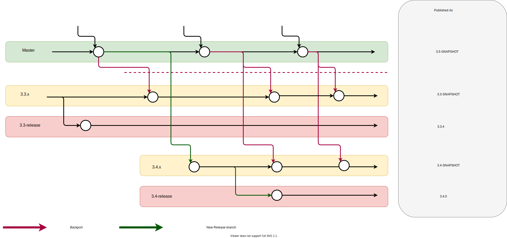

# Branches and Release Management
### We assume that each submodule supports the following branch naming scheme:

- **master** - main development branch
  - Should always be buildable
  - May not be compatible with other master branches for several days
- **Z.Y.x** branch - binary compatible with Z.Y-release branch
  - May be momentarily incompatible with related .x branches
- **Z.Y-release** - under complete control of the release process.
  - Always compatible with release-related branches of other repositories.

Changes are made on development branches which are merged via **PR** to master.
PRs marked with a release milestone will be backported to the `.x` branch associated with that milestone.
This should be the only way that `.x` branches are ever updated.
This process of backporting is automated via [Mergify](https://mergify.io/).


>Diagrams generated with [diagrams.net](https://www.diagrams.net/)

### Publishing releases
In the following diagram we see a new release being created and where master and everything gets published
- New release 3.4 is created from master
  - 3.4.x is working/snapshot branch
  - 3.4-release is lastest release of 3.4
- master sbt has version 3.5-SNAPSHOT




We make use of the fact that Git submodule support allows one to specify the branch to be used for each submodule. This allows us to deal with different branches for each submodule in each branch of the top level chisel-release repository.
The simplest case is the master branch of chisel-release.

#### Here is the master .gitmodule
```
[submodule "chisel3"]
	path = chisel3
	url = https://github.com/freechipsproject/chisel3.git
	branch = master
[submodule "firrtl"]
	path = firrtl
	url = https://github.com/freechipsproject/firrtl.git
	branch = master
[submodule "dsptools"]
	path = dsptools
	url = https://github.com/ucb-bar/dsptools.git
	branch = master
[submodule "treadle"]
	path = treadle
	url = https://github.com/freechipsproject/treadle.git
	branch = master
[submodule "diagrammer"]
	path = diagrammer
	url = https://github.com/freechipsproject/diagrammer
	branch = master
[submodule "chisel-testers2"]
	path = chisel-testers2
	url = https://github.com/ucb-bar/chisel-testers2.git
	branch = master
[submodule "chisel-template"]
	path = chisel-template
	url = https://github.com/freechipsproject/chisel-template.git
	branch = master
[submodule "chisel-tutorial"]
	path = chisel-tutorial
	url = https://github.com/ucb-bar/chisel-tutorial.git
	branch = master
```

This indicates that the master branch of chisel-release uses the master branch of each submodule.

#### Slightly more interesting is the 3.2.x branch of chisel-release:


```
[submodule "chisel3"]
	path = chisel3
	url = https://github.com/freechipsproject/chisel3.git
	branch = 3.2.x
[submodule "chisel-testers"]
	path = chisel-testers
	url = https://github.com/freechipsproject/chisel-testers.git
	branch = 1.3.x
[submodule "firrtl"]
	path = firrtl
	url = https://github.com/freechipsproject/firrtl.git
	branch = 1.2.x
[submodule "firrtl-interpreter"]
	path = firrtl-interpreter
	url = https://github.com/freechipsproject/firrtl-interpreter.git
	branch = 1.2.x
[submodule "dsptools"]
	path = dsptools
	url = git@github.com:ucb-bar/dsptools.git
	branch = 1.2.x
[submodule "treadle"]
	path = treadle
	url = https://github.com/freechipsproject/treadle.git
	branch = 1.1.x
[submodule "diagrammer"]
	path = diagrammer
	url = https://github.com/freechipsproject/diagrammer
	branch = 1.1.x
[submodule "rocket-chip"]
	path = rocket-chip
	url = https://github.com/chipsalliance/rocket-chip.git
	branch = 1.2.x
[submodule "chisel-testers2"]
	path = chisel-testers2
	url = https://github.com/ucb-bar/chisel-testers2.git
	branch = 0.1.x
```

#### Here, the submodule branches are the compatible .x branches.


The 3.2-release version of .gitmodules is:
```
[submodule "chisel3"]
	path = chisel3
	url = https://github.com/freechipsproject/chisel3.git
	branch = 3.2-release
[submodule "chisel-testers"]
	path = chisel-testers
	url = https://github.com/freechipsproject/chisel-testers.git
	branch = 1.3-release
[submodule "firrtl"]
	path = firrtl
	url = https://github.com/freechipsproject/firrtl.git
	branch = 1.2-release
[submodule "firrtl-interpreter"]
	path = firrtl-interpreter
	url = https://github.com/freechipsproject/firrtl-interpreter.git
	branch = 1.2-release
[submodule "dsptools"]
	path = dsptools
	url = https://github.com/ucb-bar/dsptools.git
	branch = 1.2-release
[submodule "treadle"]
	path = treadle
	url = https://github.com/freechipsproject/treadle.git
	branch = 1.1-release
[submodule "diagrammer"]
	path = diagrammer
	url = https://github.com/freechipsproject/diagrammer
	branch = 1.1-release
[submodule "rocket-chip"]
	path = rocket-chip
	url = https://github.com/chipsalliance/rocket-chip.git
	branch = 1.2-release
[submodule "chisel-testers2"]
	path = chisel-testers2
	url = https://github.com/ucb-bar/chisel-testers2.git
	branch = 0.1-release
```

#### Here, the submodule branches are the compatible -release branches.


This allows us to write generic scripts to deal with each submodule that avoids having to encode a specific branch in the script.


A shell command to update each submodule to the head of its associated branch is:

```bash
git submodule foreach \
  ’sbranch=$(git config -f $toplevel/.gitmodules submodule.$name.branch);
   git fetch origin $sbranch && git checkout $sbranch && git pull
  ’
```
A shell command to merge the .x branches into the -release branches (assuming we’re on the release branches and without committing the merge) is:

```
git submodule foreach \
  'sbranch=$(git config -f $toplevel/.gitmodules submodule.$name.branch);
   xbranch=$(echo $sbranch | sed -e 's/-release/.x/');
   git merge --no-ff --no-commit $xbranch;
  '
```


Typically, not all the submodules incorporated in chisel-release should participate in the foreach loops. For example, rocket-chip is a submodule of the 3.2 .x and -release branches, but should no longer be included in general submodule expressions. chisel-template and chisel-tutorial are included in the master branch of chisel-release, but they should not be included in general submodule expressions. We implement this by wrapping the foreach expression in a shell conditional. For example, to eliminate rocket-chip from the 3.2 submodule processing:
```
git submodule foreach \
  'if [ $name != "rocket-chip" ]; then
   sbranch=$(git config -f $toplevel/.gitmodules submodule.$name.branch);
   git fetch origin $sbranch && git checkout $sbranch && git pull
   ; fi
  '
```
To do the same thing for chisel-tutorial and chisel-template in the master branch:
```
git submodule foreach \
  'if [ $name != "chisel-template" -a $name != "chisel-tutorial" ]; then
   sbranch=$(git config -f $toplevel/.gitmodules submodule.$name.branch);
   git fetch origin $sbranch && git checkout $sbranch && git pull
   ; fi
  '
```
